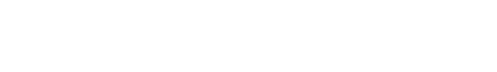
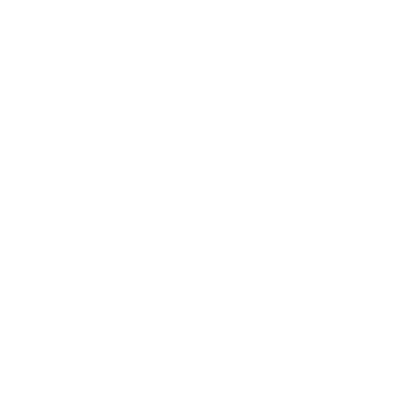

<!-- BEGIN:LINKS -->
[PATH_SRC]: ./src/
[PATH_TESTS]: ./tests/
[PATH_DOCS]: ./docs/
[PATH_ASSETS]: ./docs/assets/
[CHANGELOG]: ./CHANGELOG.md
[LICENSE]: ./LICENSE.md
[CONTRIBUTING]: ./CONTRIBUTING.md
[CODE_OF_CONDUCT]: ./CODE_OF_CONDUCT.md
[IMG_NOCLOCKS_LOGO]: ./docs/assets/img/noclocks-logo-white.png
[URL_DOCS]: https://docs.noclocks.dev/template-powershell-module/
[URL_PSGALLERY]: https://www.powershellgallery.com/packages/Template-PowerShell-Module/
[URL_GITHUB]: https://github.com/noclocks/template-powershell-module
[URL_ISSUES]: https://github.com/noclocks/template-powershell-module/issues
[URL_RELEASES]: https://github.com/noclocks/template-powershell-module/releases
<!-- END:LINKS -->

<p align="center">
  
</p>
<br>

# No Clocks PowerShell Module Template 

<br>

<!--BEGIN:CALLOUT -->
> [!TIP]
> <details><summary>Want More? Click to View our other templates!</summary><p>
>
> - [noclocks/template-generic-repo](https://github.com/noclocks/template-generic-repo): A template for creating any new repository.
> - [noclocks/template-powershell-module](https://github.com/noclocks/template-powershell-module): A template for creating a new PowerShell module.
> - [noclocks/template-python-package](https://github.com/noclocks/template-python-package): A template for creating a new Python package.
> - [noclocks/template-react-ts-starter](https://github.com/noclocks/template-react-ts-starter) A React TypeScript Starter Template..
> - [noclocks/template-crewai-langchain](https://github.com/noclocks/template-crewai-langchain): A template for creating a new CrewAI Language Chain of Autonomous Agents.
> - [noclocks/template-expo-app](https://github.com/noclocks/template-expo-app): A template for creating a new Expo (mobile) app with React Native.
> - [noclocks/template-python-flask](https://github.com/noclocks/template-python-flask): A template for creating a new Python API.
> - [noclocks/template-typescript-package](https://github.com/noclocks/template-typescript-package): A template for creating a new TypeScript package.
> - [noclocks/template-terraform-infra](https://github.com/orgs/noclocks/projects/6?pane=info): A template for creating a new Terraform project that deploys infrastructure.
> </p></details>

> [!NOTE]
> <details><summary>Expand to view an overview of this project.</summary><p>
> This is an opinionated template for creating PowerShell modules. It is based on my past experiences and the
> best practices I have learned over time working with PowerShell and its ecosystem (`.NET` and `C#`).
>
> This template is not meant to be a one-size-fits-all solution. It is meant to be a starting point for creating a
> PowerShell module that is easy to maintain, test, and use while offering modern, top-of-the-line features.
> </p></details>

> [!WARNING]
> <details><summary>Expand to view warnings associated with this project.</summary><p>
> The template is designed to be used with PowerShell 7.0 or later. It is not compatible with Windows PowerShell.
>
> The template is opinionated and comes with a set of features that I believe are essential for creating a PowerShell
> module that is easy to maintain, test, and use. However, you are free to modify the template to suit your needs.
> </p></details>
<!--END:CALLOUT -->


<!-- BEGIN:BADGES -->

<!-- END:BADGES -->

<!-- BEGIN:TOC -->
## Contents

- [Overview](#overview)
- [Features](#features)
- [Installation](#installation)
- [Usage](#usage)
- [Resources](#resources)
<!-- END:TOC -->

<!-- BEGIN:OVERVIEW -->
## Overview

This template is designed to help you create a PowerShell module that is easy to maintain, test, and use. It is based on
my past experiences and the best practices I have learned over time working with PowerShell and its ecosystem (.NET and
C#).

This template is not meant to be a one-size-fits-all solution. It is meant to be a starting point for creating a
PowerShell module that is easy to maintain, test, and use while offering modern, top-of-the-line features.

<!-- END:OVERVIEW -->

<!-- BEGIN:FEATURES -->
## Features

- **CI/CD with GitHub Actions**: The template is fully integrated with PowerShell specific GitHub Actions and Workflows.
  -  It comes with a set of GitHub Actions workflows that automate the build, test, lint, style, analysis,
     release, and publish processes as well as some utility workflows.

- **Testing Suite via Pester v5**: The template is designed to implment a full testing suite using Pester v5+.
  - It comes with a set of Pester tests that test the module's functionality, integration, and unit.
  - IT comes with built-in test helpers.

- **Dependency Management through `PSDepend`**: The template is designed to be used with PSDepend. It comes with a PSDepend file that lists the module's dependencies.

- **Plaster Support**: It comes with a Plaster template that helps you create new modules
- **PSScriptAnalyzer**: It comes with a PSScriptAnalyzer settings file that enforces
- **`PowerShellGet` and `PSResourceGet`**: It comes with a PSD1 file that lists the module's metadata.
- **PowerShell Gallery** and **GitHub Packages**: It comes with a PSD1 file that lists the module's metadata.
<!-- END:FEATURES -->

<!-- BEGIN:INSTALLATION -->

## Installation

To install the module, run the following command:

```powershell
# PSResourceGet
Install-PSResource -Name PSNoClocksTemplate -Repository PSGallery -Force -Scope CurrentUser

# PowerShellGet
Install-Module -Name PSNoClocksTemplate -Scope CurrentUser -Force
```

<!-- END:INSTALLATION -->

<!-- BEGIN:USAGE -->

## Usage

To use the module, run the following command:

```powershell
Import-Module PSNoClocksTemplate

Get-Help about_PSNoClocksTemplate

Get-Command -Module PSNoClocksTemplate
```

<!-- END:USAGE -->

<!-- BEGIN:RESOURCES -->

## Resources

- [Documentation][URL_DOCS]
- [PowerShell Gallery][URL_PSGALLERY]
- [GitHub Repository][URL_GITHUB]
- [Issues][URL_ISSUES]
- [Releases][URL_RELEASES]

<!-- END:RESOURCES -->

<!-- BEGIN:FOOTER -->
***
(c) [No Clocks, LLC](https://github.com/noclocks) All Rights Reserved | 2024
***
<!-- END:FOOTER -->
